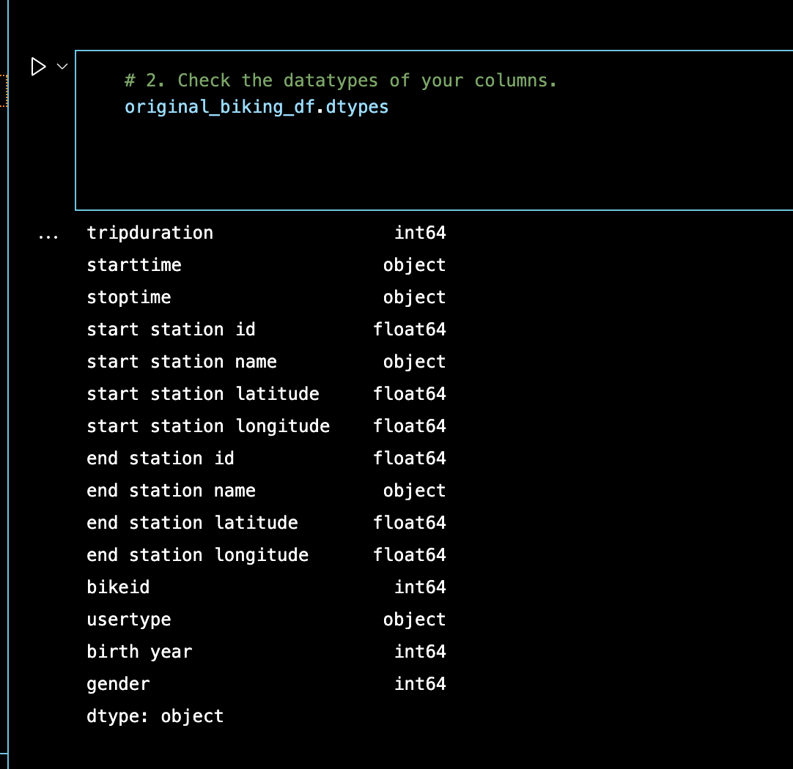
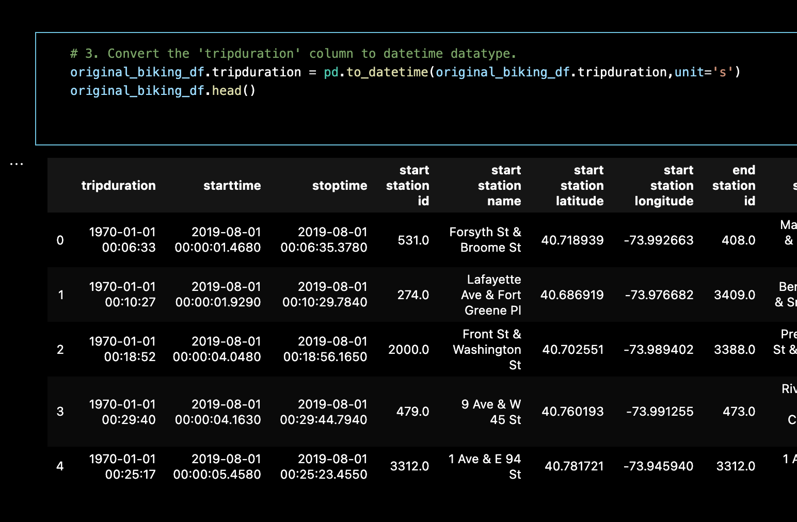
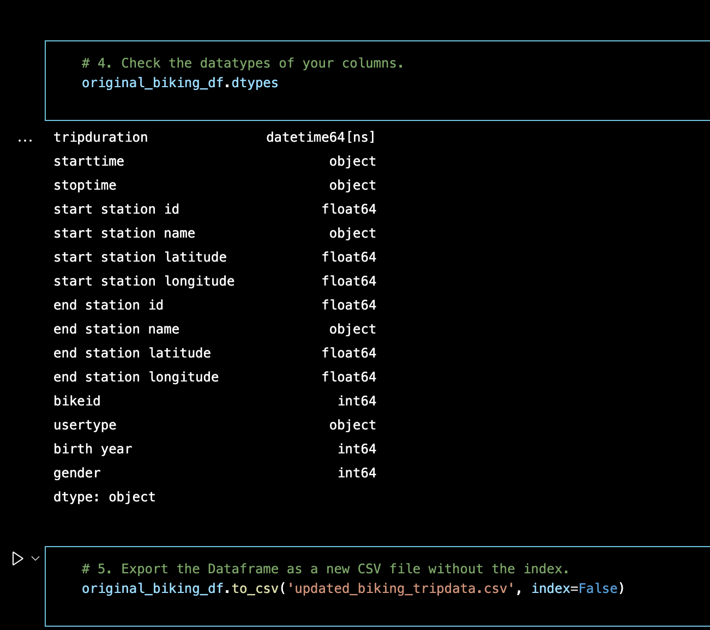
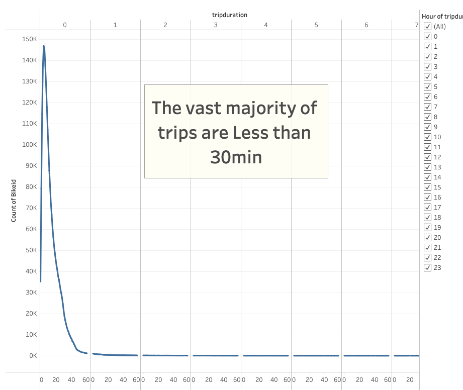
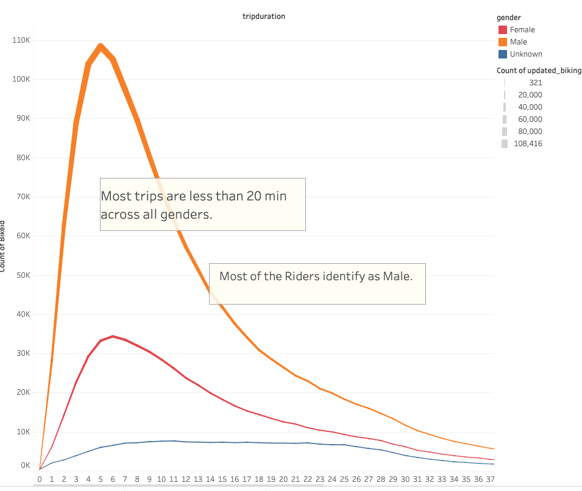
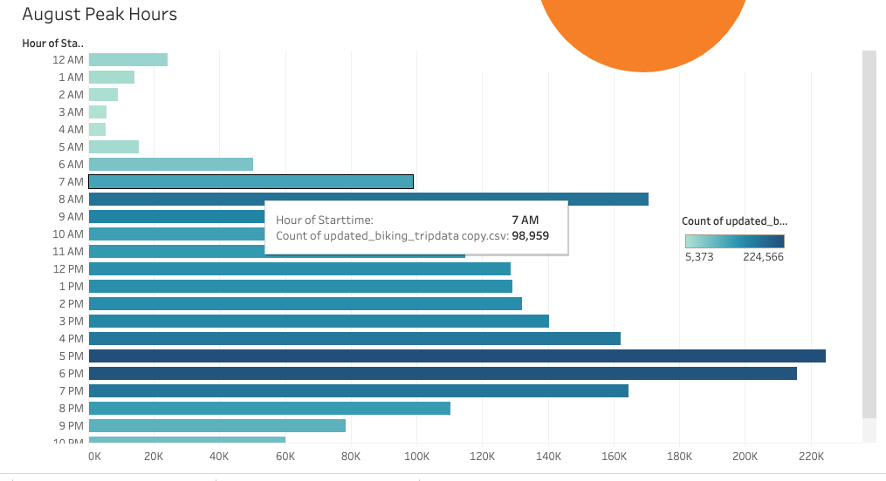
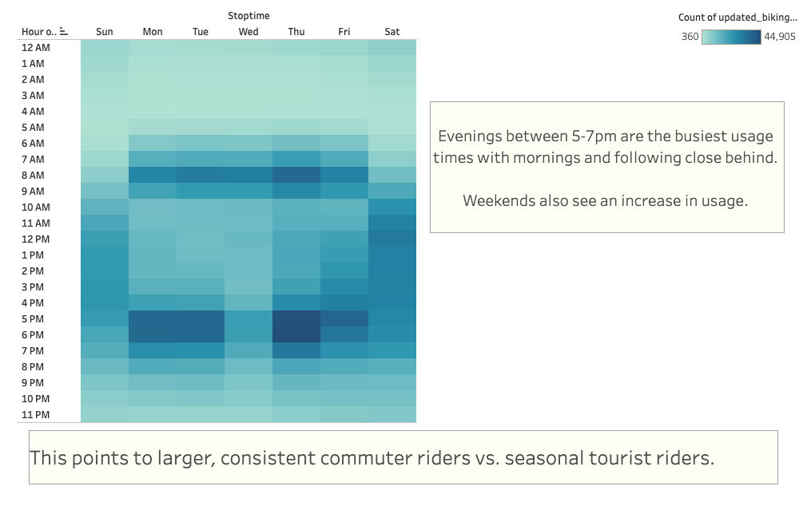
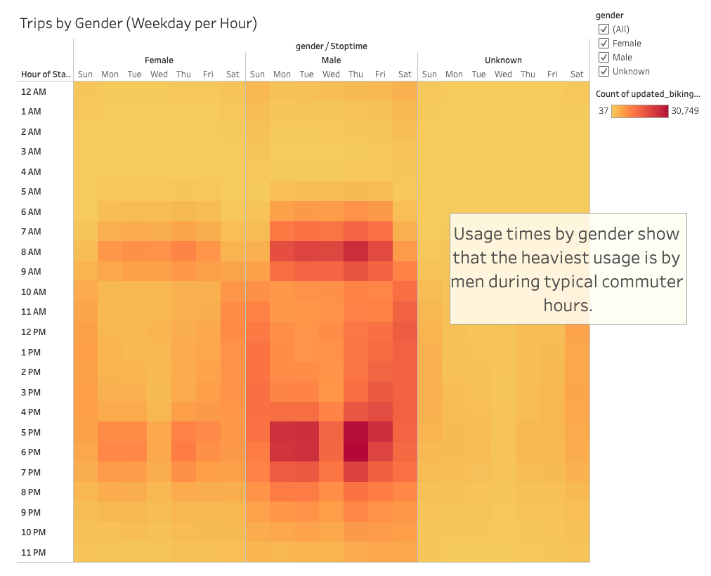
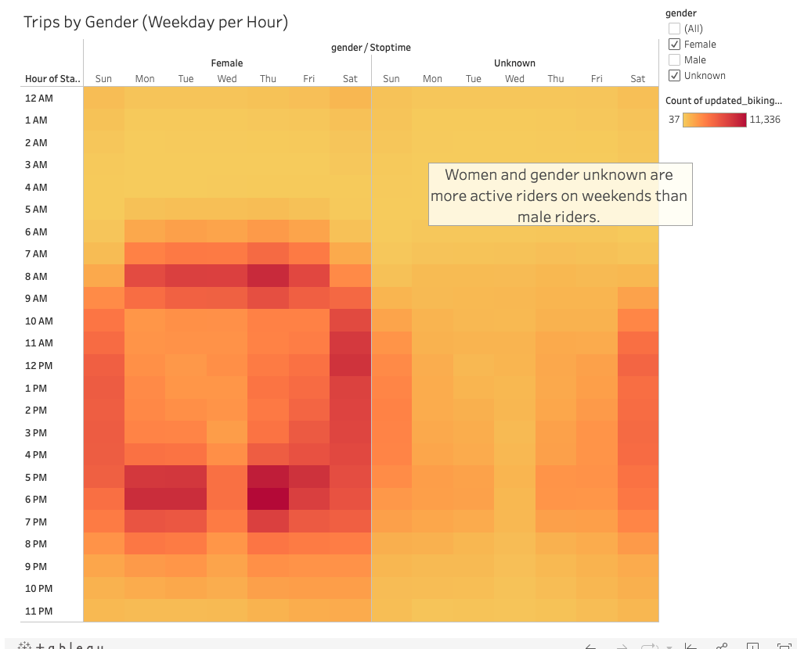
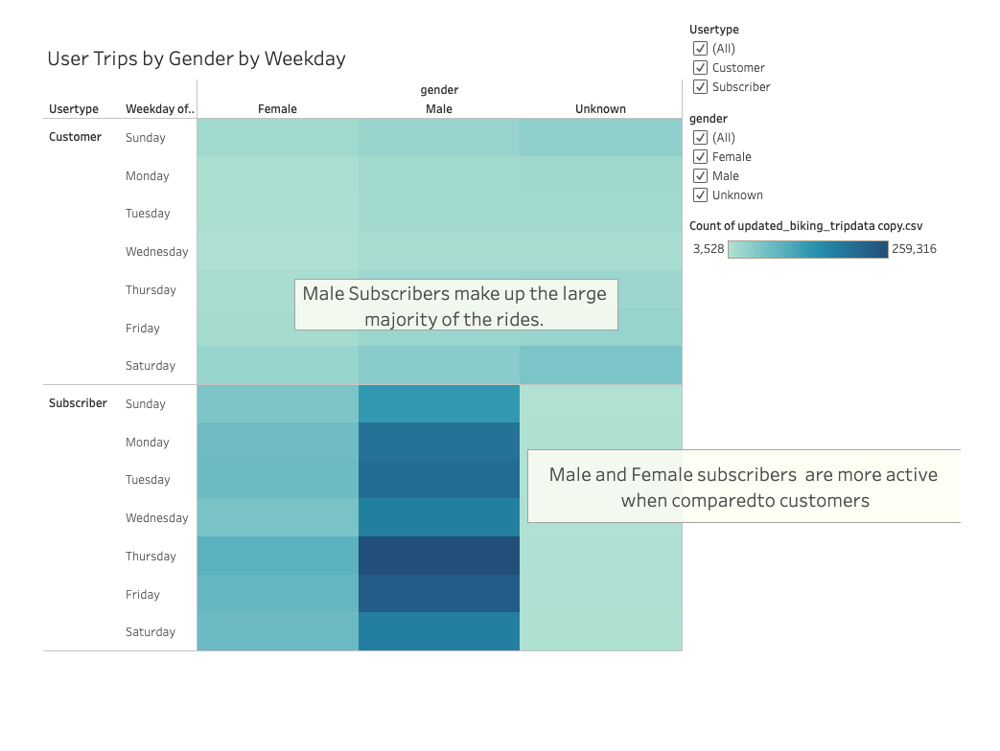

# bikesharing
Tableau analysis of Bike Sharing data. 

## Overview of the statistical analysis:
For this analysis, we are using data on the CitiBike usage from New York City from the month of August 2019 as a point of comparison for a new bike sharing business in Des Moines, Iowa.  We believe that a similar Bike sharing business will succeed in Des Moines based on the analysis summarized below. We used Python Pandas to change the datatype of the "tripduration" column from our source data from an integer to a datetime datatype. Then used Tableau Public to create a set of visualizations to show our findings. These visualizations display: 
 - the peak hours and locations of rental usage. 
 - the length of time that bikes are checked out for all riders and genders. 
 - the number of bike trips for all riders and genders for each hour of each day of the week. 
 - the number of bike trips for each type of user and gender for each day of the week.

### Linked below is the Tableau Story created based on the analysis. 

[NYC to Des Moines Dashboard](https://public.tableau.com/shared/8GRQPDJQY?:display_count=n&:origin=viz_share_link)

### Code the change the datatype of the "tripduration" column

## Results:

### The average usage time for all bike trips was less than an hour. 

### This remained true when the trip times were broken down by gender. 

### The peak usage by hour is dispalyed below. The busiest time is between 5pm-7pm, while the least number of trips are between 1am-6am. 

### When we look at the hourly usage by hour and by day of the week, we see that the busiest times of day are weekday hours during typical commuter hours. 

### When we further breakdown the hourly/daily usage by gender we see that the majority of users identify as male. 

### When we just look at the riders who identify as female and unknown, we see that there is a comparative increase in weekend usage. 

### When we look at the usage by day, gender, and user type, we see that most of the trips are from male subscribers. This indicates that male commuters with CitiBike memberships would be a loyal customer base for CitiBike in Des Moines. 

## Summary:

Based on the analysis of the data, we believe that starting a CitiBike in Des Moines, Iowa would be very successful. The focus of the business should be to build a loyal customer base of working individuals with an emphasis on the ease of using CitiBike to ease the commute to and from work. Centrally located businesses would be a great place to place advertisement information about the CitiBike program based on popularity of the pickup and drop off locations in our analysis of New York City. If the New York data can be used as a basis, CitiBike would be particularly effective with male subscribers who work and commute to the main part of the city. A potential area for increasing usage and customer base could be with users who identify as women and unknown gender. This group has a large potential to increase usage and become regular subscribers when their usage is compared to the male users. 

Further analysis could be performed to more accurately make projections for the Des Moines CitiBike location. One thing to analyze further would be to look for any changes in usage over each month of the year. Is there a dip in the winter? Do they surge in the summer or over major holiday weekends? This information would be helpful in longer term planning since it appears that most users are not tourists but regular commuter subscribers. An additional analysis could be performed on the distance traveled during trips and what the user type is for those trips. Are most trips short, which may indicate commuter usage? Are the shorter trips mainly subscribers? Are longer trips mostly customers? This would be helpful in how these different groups are targeted for marketing. Overall, we believe that an expansion of CitiBike into Des Moines would be very successful.

